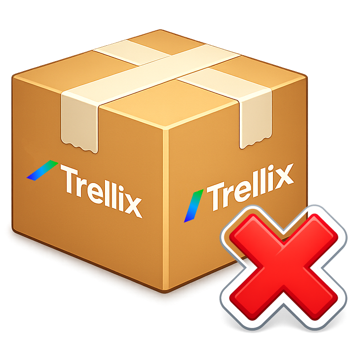

# Download-LatestTrellixENSRemoval

<div>
  

  Automated PowerShell solution that downloads the latest Trellix EPR (Endpoint Product Removal) tool from a Trellix ePO server and registers the download as a daily Windows scheduled task.

  
  
  
</div>
<br clear="left" />

## Features

- Connects to a Trellix ePO SQL Server database to query the software catalog
- Retrieves and downloads the latest EPR Tool component
- Flexible authentication: SQL credentials, encrypted password file, or PSCredential
- Interactive installer with CLI dialogs for scheduled task setup
- Daily scheduled task execution (02:00) with configurable settings
- Encrypted password file storage for unattended execution

## Requirements

- **PowerShell** 5.1 or later
- **Windows** operating system
- **Administrator privileges** (for scheduled task management)
- Access to a Trellix ePO SQL Server database

## Project Structure

```
Download-LatestTrellixENSRemoval/
├── Download-LatestTrellixENSRemoval.ps1   # Main download script
├── Install-LatestTrellixENSRemoval.ps1    # Interactive installer/uninstaller
├── .gitignore
├── README.md
├── LICENSE
└── UDF/                                    # Required PowerShell modules
    ├── PSSomeTrellixThings/                # ePO database & software catalog
    ├── PSSomeAPIThings/                    # API & URL utilities
    ├── PSSomeAuthThings/                   # Authentication & credentials
    └── PSSomeCLIThings/                    # Interactive CLI dialogs & UI
```

## Installation

Run the interactive installer as administrator:

```powershell
.\Install-LatestTrellixENSRemoval.ps1
```

The installer guides you through:

1. **Action selection** &mdash; Install or Uninstall
2. **ePO database connection** &mdash; Server, instance, database, port, credentials
3. **Installation settings** &mdash; Install directory, output directory, task name
4. **Task account** &mdash; Current user (S4U) or a specific account
5. **Confirmation** &mdash; Summary review before proceeding

You can also provide parameters directly:

```powershell
.\Install-LatestTrellixENSRemoval.ps1 -Action Install -Server "ePOSrv" -Database "ePO_DB" -DBUsername "sa"
```

### Uninstallation

```powershell
.\Install-LatestTrellixENSRemoval.ps1 -Action Uninstall
```

This removes the scheduled task and the installation directory.

## Usage

### Automated (scheduled task)

Once installed, the scheduled task runs daily at 02:00 and downloads the latest EPR Tool to the configured output directory.

### Manual execution

```powershell
# SQL authentication with password
.\Download-LatestTrellixENSRemoval.ps1 -Server "ePOSrv" -Database "ePO_DB" `
    -DBUsername "sa" -DBPassword (Read-Host -AsSecureString "Password")

# SQL authentication with encrypted password file
.\Download-LatestTrellixENSRemoval.ps1 -Server "ePOSrv" -Database "ePO_DB" `
    -DBUsername "sa" -EncryptedPasswordFile "C:\secure\epo_password.txt"

# PSCredential object
$cred = Get-Credential
.\Download-LatestTrellixENSRemoval.ps1 -Server "ePOSrv" -Database "ePO_DB" -Credential $cred

# Force overwrite of existing file
.\Download-LatestTrellixENSRemoval.ps1 -Server "ePOSrv" -Database "ePO_DB" `
    -DBUsername "sa" -EncryptedPasswordFile ".\epo_password.txt" -Force
```

## Parameters

### Download-LatestTrellixENSRemoval.ps1

| Parameter | Required | Description |
|-----------|----------|-------------|
| `Server` | Yes | ePO database server name |
| `Instance` | No | SQL Server instance name |
| `Database` | Yes | ePO database name |
| `Port` | No | SQL Server port (default: 1433) |
| `DBUsername` | Yes* | Database username |
| `DBPassword` | Yes* | Database password as SecureString |
| `EncryptedPasswordFile` | Yes* | Path to an encrypted password file |
| `Credential` | Yes* | PSCredential object |
| `OutputDir` | No | Output directory (default: `$ENV:TEMP\TrellixEPR\`) |
| `Force` | No | Overwrite existing files |

\* One authentication method is required: `DBUsername`+`DBPassword`, `DBUsername`+`EncryptedPasswordFile`, or `Credential`.

### Install-LatestTrellixENSRemoval.ps1

| Parameter | Required | Description |
|-----------|----------|-------------|
| `Action` | No | `Install` or `Uninstall` (prompted if omitted) |
| `Server` | No | ePO database server (prompted if omitted) |
| `Instance` | No | SQL Server instance name |
| `Database` | No | ePO database name (prompted if omitted) |
| `Port` | No | SQL Server port (default: 1433) |
| `DBUsername` | No | Database username |
| `DBPassword` | No | Database password as SecureString |
| `OutputDir` | No | Output directory (default: `$ENV:TEMP\TrellixEPR\`) |
| `InstallDir` | No | Installation directory (default: `$ENV:ProgramFiles\Trellix Scripts\Download Removal\`) |
| `InstallCred` | No | Credential for the scheduled task account |
| `TaskName` | No | Scheduled task name (default: `Trellix EPR Daily Download`) |
| `TaskDescription` | No | Scheduled task description |

## Disclaimer

This project is not affiliated with, endorsed by, or associated with Trellix or any of its subsidiaries. Trellix is a registered trademark of Musarubra US LLC. This tool is an independent project developed to automate the download of Trellix EPR tools from an existing ePO infrastructure.

## Author

**Loic Ade**

## License

This project is licensed under the [PolyForm Noncommercial License 1.0.0](https://polyformproject.org/licenses/noncommercial/1.0.0/). See the [LICENSE](LICENSE) file for details.

In short:
- **Non-commercial use only** &mdash; You may use, modify, and distribute this software for any non-commercial purpose.
- **Attribution required** &mdash; You must include a copy of the license terms with any distribution.
- **No warranty** &mdash; The software is provided as-is.
